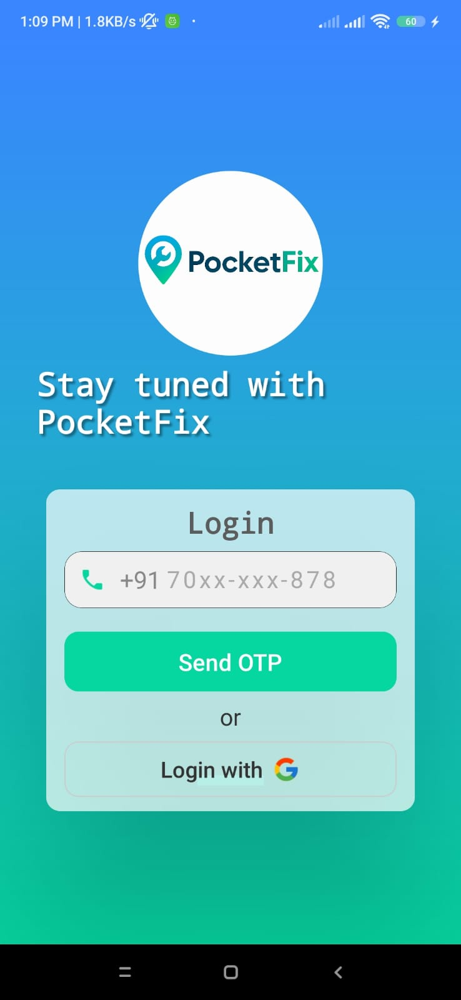
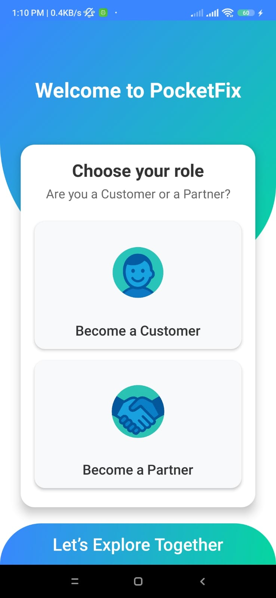
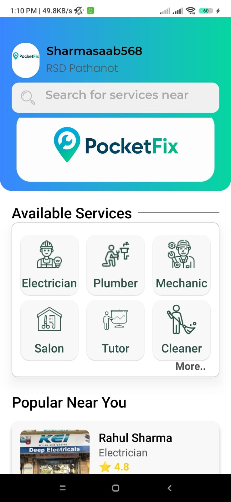
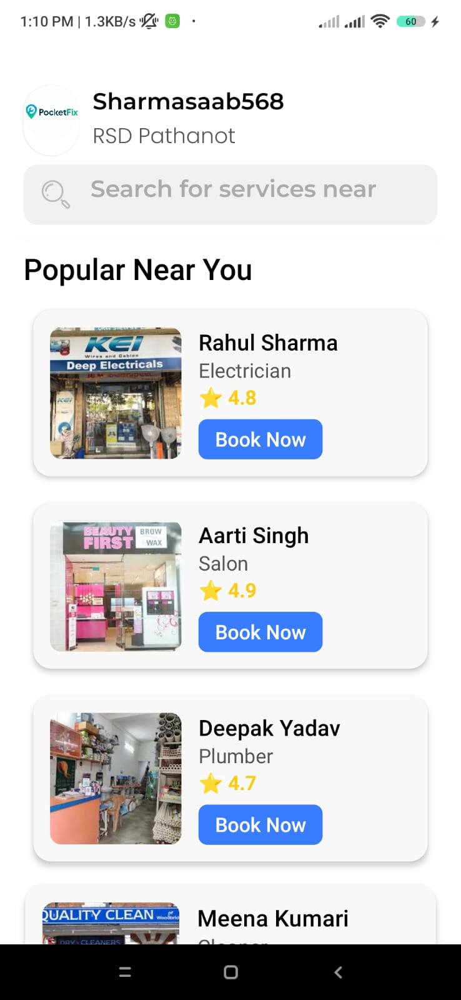
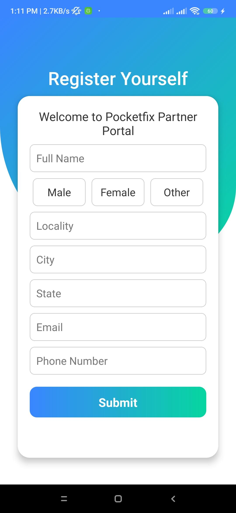

<div align="center">

# 🔧 PocketFix

### Your Pocket-Sized Local Service Marketplace

[](https://reactnative.dev/)
[](https://firebase.google.com/)
[](https://reactnative.dev/)
[](LICENSE)
[](CONTRIBUTING.md)

<br/>

> **PocketFix** connects everyday users with trusted local service professionals — electricians, plumbers, mechanics, salon workers, tutors, and cleaners — all from the palm of their hand.

</div>

---

## 📖 Project Description

PocketFix

PocketFix is a React Native-based local service marketplace application designed to connect customers with nearby skilled professionals and service providers in real time.

The platform acts as a bridge between users searching for everyday home and personal services and local shopkeepers or service partners who want to expand their business digitally.

Using location-based service discovery, customers can easily find nearby professionals for services such as:

- Electrician
- Plumber
- AC Repair
- Beauty Services
- Cleaning
- Carpenter
- Mobile Repair
- Vehicle Services
- Home Maintenance
- Computer & IT Support


Whether you need a plumber at midnight or a reliable electrician on short notice, PocketFix puts you just a tap away from verified local experts. Service providers can register their shop, manage their profile, and receive bookings — while customers can browse, filter, and book services seamlessly.

---

## ✨ Features

### 👤 For Customers
- 🔐 **OTP-based Phone Login** — Secure authentication via mobile number with Google Sign-In support
- 🏠 **Role Selection** — Choose between Customer or Partner (Shopkeeper) on onboarding
- 🔍 **Search Services** — Instantly search for services near your location
- 📂 **Browse Service Categories** — Electrician, Plumber, Mechanic, Salon, Tutor, Cleaner, and more
- 🏪 **All Shops View** — Browse all available service providers in a grid layout
- ⭐ **Shop Ratings & Reviews** — View ratings, rating count, distance, and opening hours
- 📊 **Sort & Filter** — Filter shops by Rating, Distance, or Opening Time via a slide-in drawer
- 🌟 **Popular Near You** — Discover top-rated professionals nearby with animated scroll cards
- 🎁 **Referral Program** — Refer friends and earn rewards
- 🎨 **Animated UI** — Smooth scroll-based animated header with gradient transitions

### 🏪 For Shopkeepers / Partners
- 🛒 **Shop Registration** — Register your shop with full profile: name, category, location, contact
- 📋 **Shopkeeper Dashboard** — Dedicated dashboard for managing incoming bookings and shop info
- 🔧 **Profile Management** — Update shop details, services offered, and availability

### 🛠️ General
- 💫 **Splash Screen** — Branded animated splash on app launch
- 📱 **Responsive Design** — Fully responsive, built using `Dimensions` API for all screen sizes
- 🎨 **Custom Fonts** — Montserrat & Poppins font families for a polished look
- 🌈 **Gradient Theming** — Consistent blue-to-green gradient (`#3A86FF → #06D6A0`) throughout the app

---

## 🛠️ Tech Stack

| Category | Technology |
|---|---|
| **Framework** | React Native 0.83.1 |
| **Language** | JavaScript (JSX) |
| **Navigation** | React Navigation v7 (Native Stack) |
| **Backend / Database** | Firebase Firestore (`@react-native-firebase`) |
| **UI Animations** | React Native Animated API, `react-native-animatable` |
| **Gradients** | `react-native-linear-gradient` |
| **Typography** | `react-native-global-font` (Montserrat, Poppins) |
| **State Management** | React Hooks (`useState`, `useEffect`, `useCallback`, `useRef`) |
| **Testing** | Jest + React Test Renderer |
| **Linting** | ESLint + Prettier |
| **Build Tool** | Metro Bundler |
| **Platform** | Android (+ iOS ready) |

---

## 📁 Folder Structure

```
PocketFix-main/
├── android/                        # Android native project files
│   └── app/
│       ├── build.gradle            # Android build config
│       ├── google-services.json    # Firebase config for Android
│       └── src/main/
│           ├── assets/
│           │   └── fonts/          # Montserrat font family (.ttf)
│           └── AndroidManifest.xml
├── Screen/                         # All application screens
│   ├── images/                     # Local image assets
│   ├── shopkeeper/                 # Shopkeeper-specific screens
│   │   ├── RegisterShop.js         # Shop registration form
│   │   └── ShopsDashboard.js       # Shopkeeper dashboard
│   ├── AllShopes.js                # Browse all service providers
│   ├── DashBoard.js                # Customer home dashboard
│   ├── LoginPage.js                # Phone + Google login
│   ├── MapArray.js                 # Static data: services & popular shops
│   ├── Register.js                 # Customer registration
│   ├── SelectAccount.js            # Role selection (Customer / Partner)
│   ├── Shop.js                     # Individual shop details
│   ├── SplashScreen.js             # Launch splash screen
│   └── fonts.js                    # Global font initializer
├── __tests__/                      # Unit tests
│   └── App.test.tsx
├── App.js                          # Root component & navigation setup
├── package.json                    # Project dependencies
├── .eslintrc.js                    # ESLint config
├── .prettierrc.js                  # Prettier config
└── Gemfile                         # iOS CocoaPods (Ruby)
```

---

## ⚙️ Requirements

Before you begin, make sure you have the following installed:

| Requirement | Version |
|---|---|
| Node.js | >= 20.x |
| npm | >= 10.x |
| React Native CLI | Latest |
| Android Studio | Latest (with SDK 33+) |
| Java (JDK) | 17 |
| Ruby (for iOS) | >= 2.7 |
| Xcode (iOS only) | 14+ |

> 📌 Refer to the official [React Native Environment Setup](https://reactnative.dev/docs/environment-setup) guide for a complete walkthrough.

---

## 🔑 Environment Variables

PocketFix uses **Firebase** for backend services. You'll need to configure your own Firebase project.

### Steps to configure Firebase:

1. Go to [Firebase Console](https://console.firebase.google.com/) and create a new project.
2. Add an **Android app** to your project with your app's package name.
3. Download the `google-services.json` file and place it here:

```
android/app/google-services.json
```

4. Enable **Firestore Database** in your Firebase project (start in test mode for development).

> ⚠️ **Never commit your `google-services.json` to a public repository.** Add it to `.gitignore`.

---

## 🚀 Installation Steps

### 1. Clone the Repository

```bash
git clone https://github.com/YOUR_USERNAME/PocketFix.git
cd PocketFix
```

### 2. Install JavaScript Dependencies

```bash
npm install
```

### 3. Install iOS Pods (macOS only)

```bash
cd ios && pod install && cd ..
```

### 4. Add Firebase Config

Place your `google-services.json` in `android/app/` as described in the [Environment Variables](#-environment-variables) section.

---

## ▶️ How to Run the Project

### Start the Metro Bundler

```bash
npm start
```

### Run on Android

Make sure your Android emulator is running or a physical device is connected via USB with USB debugging enabled.

```bash
npm run android
```

### Run on iOS (macOS only)

```bash
npm run ios
```

### Run Tests

```bash
npm test
```

### Lint the Code

```bash
npm run lint
```

---

## 📦 Build APK / Production Build

### Step 1 — Generate a Signing Keystore

> Skip this step if you already have a `release.keystore` file.

```bash
keytool -genkeypair -v \
  -storefile android/app/release.keystore \
  -alias pocketfix-key \
  -keyalg RSA \
  -keysize 2048 \
  -validity 10000
```

### Step 2 — Configure Signing in `android/app/build.gradle`

In the `android` block, add:

```gradle
signingConfigs {
    release {
        storeFile file('release.keystore')
        storePassword 'YOUR_STORE_PASSWORD'
        keyAlias 'pocketfix-key'
        keyPassword 'YOUR_KEY_PASSWORD'
    }
}

buildTypes {
    release {
        signingConfig signingConfigs.release
        minifyEnabled true
        proguardFiles getDefaultProguardFile('proguard-android-optimize.txt'), 'proguard-rules.pro'
    }
}
```

### Step 3 — Build the Release APK

```bash
cd android
./gradlew assembleRelease
```

The APK will be generated at:

```
android/app/build/outputs/apk/release/app-release.apk
```

### Step 4 — Build AAB (for Google Play Store)

```bash
cd android
./gradlew bundleRelease
```

The AAB will be at:

```
android/app/build/outputs/bundle/release/app-release.aab
```

---

## 📸 Screenshots

> 📌 _Add screenshots of the app here. Recommended size: 390×844px (iPhone 14 / Pixel 6)_

| Splash Screen | Login Page | Dashboard |
|---|---|---|
|  |  |  |

| Service Categories
| 

| Register | 
|---|
| | 

---

## 🔮 Future Improvements

- [ ] 🗺️ **Real-time GPS Integration** — Show shops and professionals on an interactive map
- [ ] 💬 **In-App Chat** — Direct messaging between customers and service providers
- [ ] 📅 **Booking & Scheduling System** — Calendar-based appointment booking
- [ ] 🔔 **Push Notifications** — Booking confirmations, status updates via Firebase Cloud Messaging
- [ ] 💳 **Payment Gateway Integration** — In-app payments (Razorpay / Stripe)
- [ ] 🌐 **Multi-language Support** — Hindi and other regional language support (i18n)
- [ ] ⭐ **Live Reviews & Ratings** — Dynamic ratings stored and fetched from Firestore
- [ ] 📊 **Analytics Dashboard** — Track app usage and bookings via Firebase Analytics
- [ ] 🔒 **Full OTP Authentication** — Complete Firebase Phone Auth implementation
- [ ] 🧑‍💼 **Admin Panel** — Web-based admin panel for managing users and listings

---

## 🤝 Contributing

Contributions, issues, and feature requests are welcome!

1. **Fork** the repository
2. Create your feature branch:
   ```bash
   git checkout -b feature/amazing-feature
   ```
3. Commit your changes:
   ```bash
   git commit -m "feat: add amazing feature"
   ```
4. Push to the branch:
   ```bash
   git push origin feature/amazing-feature
   ```
5. Open a **Pull Request**

Please make sure your code follows the existing ESLint + Prettier configuration before submitting.

---

## 📄 License

This project is licensed under the **MIT License**.

```
MIT License

Copyright (c) 2025 PocketFix

Permission is hereby granted, free of charge, to any person obtaining a copy
of this software and associated documentation files (the "Software"), to deal
in the Software without restriction, including without limitation the rights
to use, copy, modify, merge, publish, distribute, sublicense, and/or sell
copies of the Software, and to permit persons to whom the Software is furnished
to do so, subject to the following conditions:

The above copyright notice and this permission notice shall be included in all
copies or substantial portions of the Software.

THE SOFTWARE IS PROVIDED "AS IS", WITHOUT WARRANTY OF ANY KIND, EXPRESS OR
IMPLIED, INCLUDING BUT NOT LIMITED TO THE WARRANTIES OF MERCHANTABILITY,
FITNESS FOR A PARTICULAR PURPOSE AND NONINFRINGEMENT. IN NO EVENT SHALL THE
AUTHORS OR COPYRIGHT HOLDERS BE LIABLE FOR ANY CLAIM, DAMAGES OR OTHER
LIABILITY, WHETHER IN AN ACTION OF CONTRACT, TORT OR OTHERWISE, ARISING FROM,
OUT OF OR IN CONNECTION WITH THE SOFTWARE OR THE USE OR OTHER DEALINGS IN THE
SOFTWARE.
```

---

## 👨‍💻 Author

<div align="center">

**[Kashish Sharma]**

[](https://github.com/sharmasaab568)
[](https://linkedin.com/in/kashishsharmasoftware)
[](mailto:karansharm346569466@email.com)

_Built with ❤️ using React Native_

</div>

---

<div align="center">

⭐ **If you found this project helpful, please give it a star!** ⭐

</div>
